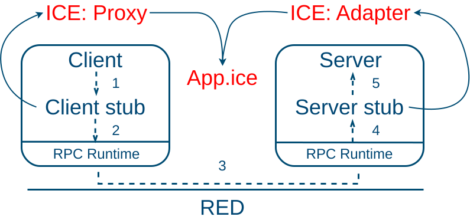

# RPC - Remote Procedure Call

La idea detrás de RPC es hacer que una llamada a un procedimiento remoto se parezca tanto como sea posible a una llamada local, intentando apstraer las operaciones de red a un alto nivel. En su forma más simple, para llamar a un procedimiento remoto, el programa cliente debe estar enlazado con un pequeño procedimiento de _biblioteca_, llamado stub del cliente, en Ice este es conocido como un _Proxy_, que representa el procedimiento del servidor en el espacio de direcciones del cliente. Del mismo modo, el servidor está vinculado a un procedimiento llamado stub del servidor, en Ice es conocido como el _Adapter_. Estos procedimientos ocultan el hecho de que la llamada al procedimiento del cliente al servidor no es local, El siguiente diagrama muestra un resumen de los componentes de un RPC, y como se traducen a Ice

_Figura 1. Descripción y secuencia de un RPC (Con los componentes de Ice en rojo)_

Esta _biblioteca_ es definida por medio de un  archivo .ice, el cual es definido en el lenguaje [slice](https://doc.zeroc.com/ice/3.6/the-slice-language)

Los pasos que sigue un RPC se resumen en la figura 1. los pasos son: 

- El cliente llama al client stup, en el caso de Ice llama al Ice Proxy

- El stub del cliente (Ice Proxy) empaquetando los parámetros en un mensaje y haciendo una llamada al RPC Runtime (Ice) para enviar el mensaje.

- Es el RPC Runtime (Ice) que envía el mensaje desde la máquina cliente a la máquina servidor.

- El RPC Runtime (Ice) que pasa el paquete entrante al stub del servidor (Adapter de Ice).

- El stub del servidor (Adapter de Ice)  llamando al procedimiento del servidor con los parámetros. La respuesta sigue el mismo camino en la otra dirección.

Este repositorio tiene un ejemplo basico de la herramienta, puede consultar un ejemplo mas completo puede ir a [este tutorial](https://github.com/Cl0udX/query_dist/tree/master)
