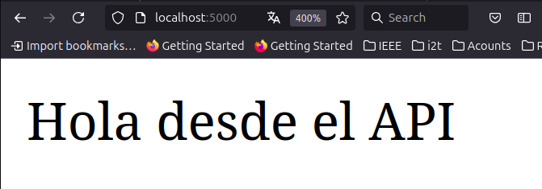
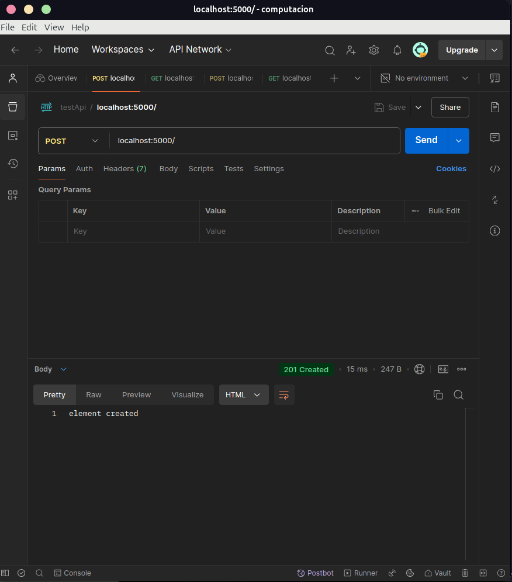
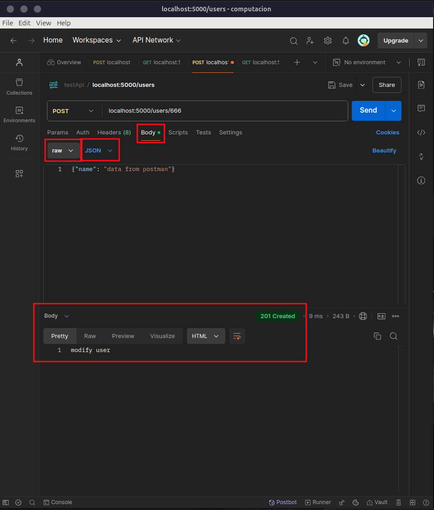
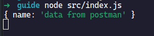
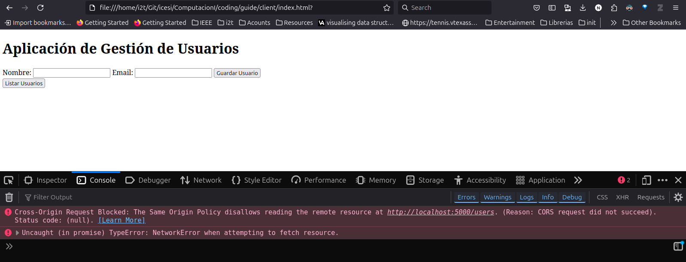
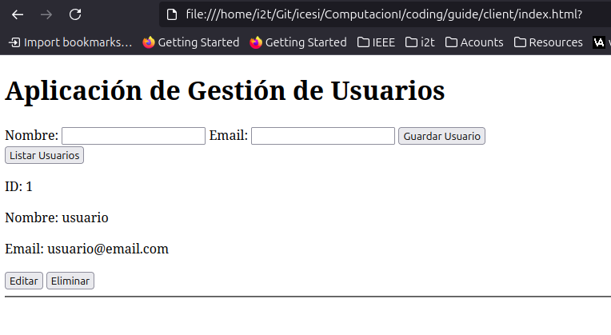

# Creación de un API REST con NodeJs

## Creación del proyeto

```bash
$ npm init -y 
$ ls 
package.json
```

## instalación de los modumos necesarios

```bash
$ npm install express
$ ls 
node_modules  package.json  package-lock.json
```

## estructura del proyecto:

```bash
. (Proyec root)
├── package.json
├── package-lock.json
├── public
│   ├── index.html
│   └── styles.css
└── src
    ├── app.js
    └── index.js
```

## Editando el archivo index.js

```js
const express = require("express")
const app = express()
app.use(express.json())

const port = 5000

app.listen(port)
```

## Creando las rutas del API:

```js
const express = require("express")
const app = express()
app.use(express.json())

const port = 5000

// método | verbo GET
app.get("/", (req, res) => {
  res.status(200).send("Hola desde el API")  
})

app.listen(port)
```

Respuesta del lado del cliente: 



```js
const express = require("express")
const app = express()
app.use(express.json())

const port = 5000

// método | verbo GET
app.get("/", (req, res) => {
  // 200 -> OK : https://developer.mozilla.org/en-US/docs/Web/HTTP/Status/200
  res.status(200).send("Hola desde el API")  
})

app.post("/", (req, res) => {
   // 201 -> OK -> Data Created : https://developer.mozilla.org/en-US/docs/Web/HTTP/Status/201
  res.status(201).send("element created")  
})

app.listen(port)
```

Solicitud desde POSTMAN



Metodo PUT / DELETE: 

```js
const express = require("express")
const app = express()
app.use(express.json())

const port = 5000

// método | verbo GET
app.get("/", (req, res) => {
  // 200 -> OK : https://developer.mozilla.org/en-US/docs/Web/HTTP/Status/200
  res.status(200).send("Hola desde el API")  
})

app.post("/", (req, res) => {
   // 201 -> OK -> Data Created : https://developer.mozilla.org/en-US/docs/Web/HTTP/Status/201
  res.status(201).send("element created")  
})

app.put("/", (req, res) => {
  res.status(204).send("NO Content in edit")  
})

app.delete("/", (req, res) => {
  res.staus(204).send("NO content in delete")  
})

app.listen(port)
```

## Creación de modulos propios

Nueva estructura 

```bash
. (Proyec root)
├── package.json
├── package-lock.json
├── public
│   ├── index.html
│   └── styles.css
└── src
    ├── control
    │   └── user.js 
    └── index.js
```

En `control/user.js`:

```js
const User = {
    // GET -> Listar
    list: (req, res) => {
        res.status(200).send("Lista de usuarios")
    }, 
    get: (req, res) => {
        res.status(200).send("Get unique element")
        console.log(req.params)
    },
    // POST -> Modificar
    create: (req, res) => {
        res.status(201).send("modify user")
        console.log(req.body)  
    }
}

module.exports = User
```

## importando un modulo propio:

en `index.js`:

```js
const express = require("express")
const user = require("./control/user.js")

const app = express()
app.use(express.json())

const port = 5000

// Creando los endpoints para la gestion de usuarios:
app.get("/users", user.list)

app.get("/users/:id", user.get)

app.post("/users/:id", user.create)


// método | verbo GET
app.get("/", (req, res) => {
  // 200 -> OK : https://developer.mozilla.org/en-US/docs/Web/HTTP/Status/200
  res.status(200).send("Hola desde el API")  
})

app.post("/", (req, res) => {
   // 201 -> OK -> Data Created : https://developer.mozilla.org/en-US/docs/Web/HTTP/Status/201
  res.status(201).send("element created")  
})

app.put("/", (req, res) => {
  res.status(204).send("NO Content in edit")  
})

app.delete("/", (req, res) => {
  res.status(204).send("NO content in delete")  
})

app.listen(port)
```

Para probar el POST: 



Del lado del servidor: 



## "Base de datos local" (con archivos JSON)

Necesitamos crear un modelo de datos, cambiar la logica del controlador, y crear un archivo de "base de datos" local.

Nueva estructura del proyecto: 

```bash
. (Proyec root)
├── package.json
├── package-lock.json
├── public
│   ├── index.html
│   └── styles.css
└── src
│   ├── model
│   │   └── user.js
│   ├── control
│   │   └── usercontroller.js 
│   └── index.js
└── data
    └── database.json
```

Contenido de la "base de datos": 

```json
{
  "users": [  ]
}
```

Crear un modulo para leer y escribir sobre un archivo JSON en `src/connection/database.js`: 

```js
const path = require("path")
const fs = require("fs")

const dbPath = path.join(__dirname, "../..", 'data', 'database.json')

const DBConnection = {
    readDB: () => {
        const data = fs.readFileSync(dbPath, 'utf-8')
        return JSON.parse(data)
    }, 

    writeDB: (data) => {
        fs.writeFileSync(dbPath, JSON.stringify(data, null, 2))
    }
}

module.exports = DBConnection
```

Crear el modulo de usuarios en: `module/user.js`:

```js
class User {
    constructor(name, email){
        this.name = name;
        this.email = email;
    }
}

module.exports = User;
```

Modificar el controlador para el registro de usuarios, en `control/usercontroller.js`:  

```js
const dbConnection = require("../connection/database")
const user = require("../model/user")

const UserController = {
    // GET
    list: (req, res) => {
    const db = dbConnection.readDB()
        res.status(200).json(db.users)
    }, 
    // GET (id)
    get: (req, res) => {
        const db = dbConnection.readDB(); 
        const id = parseInt(req.params.id);
        const userGet = db.users.find(user => user.id === id)
        res.status(200).send( userGet )
    },
    // POST 
    create: (req, res) => {
        const db = dbConnection.readDB()
        const userData = req.body
        const newUser = new user(userData.name, userData.email)

        newUser.id = db.users.length ? db.users[db.users.length - 1].id + 1 : 1;

        db.users.push(newUser)
        dbConnection.writDB(db)

        res.status(201).send("create user user")
    },
    // PUT 
    update: (req, res) => {
        const db = dbConnection.readDB();
        const userData = req.body
        const id = req.params.id;
        const userIndex = db.users.findIndex(user => user.id == id)
        db.users[userIndex] = { id, ...userData };
        dbConnection.writeDB(db)
        res.status(204).send("User Modify!")
    }, 
    // DELETE
    delete: (req, res) => {
        const db = dbConnection.readDB(); 
        const id = req.params.id;
        const userIndex = db.users.findIndex(user => user.id == id)
        db.users.splice(userIndex, 1); 
        dbConnection.writeDB(db)
        res.status(204).send("User Deleted!")
    }
}

module.exports = UserController;
```

El nuevo `index.js` queda: 

```js
const express = require("express")
const user = require("./control/usercontroller")

const app = express()
app.use(express.json())

const port = 5000

app.get("/users", user.list)

app.get("/users/:id", user.get)

app.post("/users/", user.create)

app.put("/users/:id", user.update)

app.delete("/users/:id", user.delete)

app.listen(port)
```

## Manejo de Excepciones

Modificiación del modelo `model/user.js`, para que lance un error cuando los parámetros llegan como `undefine`

```js
class User {

    constructor(name, email){

    if(!name || !email){
        throw new Error("Name or Email are Empty")
    }
    this.name = name;
    this.email = email; 
    }
}

module.exports = User;
```

Modificamos el controlador de los usuarios para lanzar excepciones cuando una operación no es valida: 

```js
const dbConnection = require("../connection/database")
const user = require("../model/user")

const UserController = {
    // GET -> Listar
    list: (req, res) => {
        const db = dbConnection.readDB()
        res.status(200).json(db.users)
    }, 
    get: (req, res) => {
        try{
            const db = dbConnection.readDB(); 
            const id = req.params.id;
            const userGet = db.users.find(user => user.id == id)
            if(!userGet){
                res.status(404).json({error: "user not found"})
            }
            else{
                res.status(200).send( userGet )
            }
        }
        catch(error){
            res.status(500).json({error: error.message})
        }
    },
    // POST 
    create: (req, res) => {
        try {
            const db = dbConnection.readDB()
            const userData = req.body
            const newUser = new user(userData.name, userData.email)

            newUser.id = db.users.length ? db.users[db.users.length - 1].id + 1 : 1;

            db.users.push(newUser)
            dbConnection.writDB(db)

            res.status(201).send("create user user")
        }
        catch(error){
            res.status(500).json({error: error.message })
        }
    },
    // PUT 
    update: (req, res) => {
        try{
            const db = dbConnection.readDB();
            const userData = req.body
            const id = parseInt(req.params.id);
            const userIndex = db.users.findIndex(user => user.id === id)

            if(userIndex === -1){
                res.status(404).json({error: "User Not Found"})
            }
            else{
                db.users[userIndex] = { id, ...userData };
                dbConnection.writDB(db)
                res.status(204).send()
            }
        }
        catch(error){
            res.status(500).json({error: error.message})
        }
    }, 
    delete: (req, res) => {

        try{
            const db = dbConnection.readDB(); 
            const id = req.params.id;
            const userIndex = db.users.findIndex(user => user.id == id)

            if(userIndex === -1){
                res.status(404).json({error: "User Not Found"})
            }
            else{
                db.users.splice(userIndex, 1); 
                dbConnection.writDB(db)
                res.status(204).send()
            }
        }
        catch(error){
            res.status(500).json({error: error.message})
        }
    }
}

module.exports = UserController;
```

## Enviar un HTML al cliente:

Crear el recurso en `public/notfound.html`:

```html
<!DOCTYPE html>
<html>
    <head>
    <meta charset="utf-8">
    <meta name="viewport" content="width=device-width">
    <title>404</title>
    </head>
    <body>
    <h1 id="title"> 404 NOT FOUND </h1>
    </body>
</html>
```

Actualizar el `index.js`:

```js
const express = require("express")
const path = require('path');
const user = require("./control/usercontroller")

const app = express()
app.use(express.json())

const port = 5000

// Creando los endpoints para la gestion de usuarios:
app.get("/users", user.list)

app.get("/users/:id", user.get)

app.post("/users/", user.create)

app.put("/users/:id", user.update)

app.delete("/users/:id", user.delete)

app.get('*', (req, res) => {
    res.status(404).sendFile(path.join(__dirname, '..', 'public' , 'notfound.html'))
})

app.listen(port)
```

## Crear aplicación del cliente:

estructura del proyecto: 

```bash
client
├── index.html
└── index.js
```

Crear el HTML: 

```html
<!DOCTYPE html>
<html lang="en">
<head>
    <meta charset="UTF-8">
    <meta name="viewport" content="width=device-width, initial-scale=1.0">
    <title>Gestión de Usuarios</title>
</head>
<body>
    <h1>Aplicación de Gestión de Usuarios</h1>

    <form id="user-form">
        <input type="hidden" id="user-id">
        <label for="name">Nombre:</label>
        <input type="text" id="name" required>
        <label for="email">Email:</label>
        <input type="email" id="email" required>
        <button type="submit">Guardar Usuario</button>
    </form>

    <button onclick="listUsers()">Listar Usuarios</button>

    <div id="users-list"></div>

    <script src="index.js"></script>
</body>
</html>
```

Crear el `index.js`:

```js
const apiUrl = 'http://localhost:5000/users';

// Función para listar usuarios
async function listUsers() {
    const response = await fetch(apiUrl);
    const users = await response.json();
    const usersList = document.getElementById('users-list');
    usersList.innerHTML = '';
    users.forEach(user => {
        const userDiv = document.createElement('div');
        userDiv.innerHTML = `
            <p>ID: ${user.id}</p>
            <p>Nombre: ${user.name}</p>
            <p>Email: ${user.email}</p>
            <button onclick="editUser(${user.id})">Editar</button>
            <button onclick="deleteUser(${user.id})">Eliminar</button>
            <hr>
        `;
        usersList.appendChild(userDiv);
    });
}

// Función para crear o actualizar usuario
document.getElementById('user-form').onsubmit = async (e) => {
    e.preventDefault();
    const id = document.getElementById('user-id').value;
    const name = document.getElementById('name').value;
    const email = document.getElementById('email').value;
    const userData = { name, email };

    if (id) {
        // Actualizar usuario
        await fetch(`${apiUrl}/${id}`, {
            method: 'PUT',
            headers: {
                'Content-Type': 'application/json'
            },
            body: JSON.stringify(userData)
        });
    } else {
        // Crear nuevo usuario
        await fetch(apiUrl, {
            method: 'POST',
            headers: {
                'Content-Type': 'application/json'
            },
            body: JSON.stringify(userData)
        });
    }
    listUsers();
    resetForm();
};

// Función para eliminar usuario
async function deleteUser(id) {
    await fetch(`${apiUrl}/${id}`, { method: 'DELETE' });
    listUsers();
}

// Función para editar usuario (carga los datos en el formulario)
async function editUser(id) {
    const response = await fetch(`${apiUrl}/${id}`);
    const user = await response.json();
    document.getElementById('user-id').value = user.id;
    document.getElementById('name').value = user.name;
    document.getElementById('email').value = user.email;
}

// Función para limpiar el formulario después de guardar
function resetForm() {
    document.getElementById('user-id').value = '';
    document.getElementById('name').value = '';
    document.getElementById('email').value = '';
}

// Llamar a listUsers() cuando la página esté completamente cargada
window.onload = () => {
    listUsers();
};
```

Lo primero que cargará será un problema de `CORS`: 



Debemos habilitar el modulo en la aplicación del servidor: 

1. Instalar la librería: 
   
   ```bash
   npm install cors
   ```

2. modificar el archivo `index.js`:

```js
const express = require("express")
const cors = require("cors"); // Importar la librería
const path = require('path');
const user = require("./control/usercontroller")

const app = express()
app.use(express.json())

app.use(cors()); // Habilitarla

const port = 5000

// Creando los endpoints para la gestion de usuarios:
app.get("/users", user.list)

app.get("/users/:id", user.get)

app.post("/users/", user.create)

app.put("/users/:id", user.update)

app.delete("/users/:id", user.delete)

app.get('*', (req, res) => {
    res.status(404).sendFile(path.join(__dirname, '..', 'public' , 'notfound.html'))
})

app.listen(port)
```


